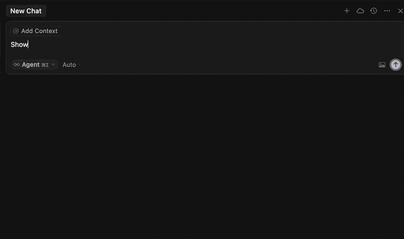

# Rootly MCP Server for Cloudflare Workers

A remote MCP (Model Context Protocol) server written in TypeScript that provides AI agents access to the Rootly API for incident management. Users provide their own Rootly API tokens for secure access to their organization's incidents.



## Usage

### Cursor IDE Configuration

Add this to your `.cursor/mcp.json` file:

```json
{
  "mcpServers": {
    "rootly": {
      "command": "npx",
      "args": ["-y", "mcp-remote", "https://incidents.rootly-mcp-server.workers.dev/sse", "--header", "Authorization:${ROOTLY_AUTH_HEADER}"],
      "env": {"ROOTLY_AUTH_HEADER": "Bearer <YOUR_ROOTLY_API_TOKEN>"}
    }
  }
}
```

Replace `<YOUR_ROOTLY_API_TOKEN>` with your actual Rootly API token.

### Example Questions

Once configured, you can ask Cursor:

- "Show me recent incidents"
- "Get details for incident ID 12345" 
- "List all teams in my organization"
- "What alerts are associated with incident 67890?"
- "Show me workflow runs"

### Available Tools

The server provides 25+ tools covering:

- **Incidents**: Get incidents, get incident alerts
- **Alerts**: Get alerts, get specific alert details
- **Teams**: List teams, get team details
- **Services**: List services, get service details  
- **Severities**: List severities, get severity details
- **Users**: List users, get user details, get current user
- **Workflows**: List workflows, get workflow details, get workflow runs
- **Environments**: List environments, get environment details
- **Functionalities**: List functionalities, get functionality details
- **Incident Types**: List incident types, get incident type details
- **Action Items**: List action items, get action items for incidents
- **Status Pages**: List status pages, get status page details

### Getting Your Rootly API Token

1. Log in to your Rootly dashboard
2. Go to **Settings** → **API Tokens**
3. Create a new token with appropriate permissions
4. Copy the token for use with the MCP server

## Contributing

### Adding New API Endpoints

To add new Rootly API endpoints to the MCP server:

1. Fork the repository and create a feature branch
2. Edit the `apiMap` object in `src/index.ts` to add your new endpoints
3. Reference the [Rootly API documentation](https://docs.rootly.com/api-reference) for available endpoints and parameters
4. Test locally with `npm run dev`
5. Submit a pull request with your changes, or reach out to spencer.cheng@rootly.com to be added to the Cloudflare account

### Configuration

The server configuration is managed through the `apiMap` object in `src/index.ts`, which maps MCP tool names to Rootly API endpoints.

## Logs

Check Cloudflare Workers logs in your Cloudflare dashboard for debugging information.